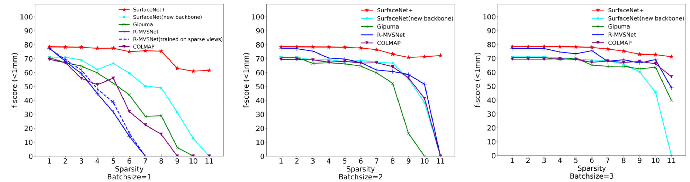
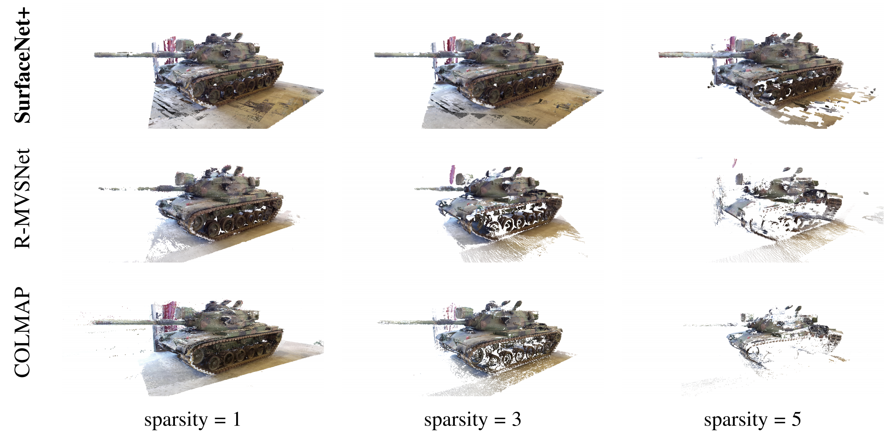

# SurfaceNet+
- An End-to-end 3D Neural Network for Very Sparse MVS. 
    * 2020TPAMI [early access link](https://ieeexplore.ieee.org/document/9099504).
    * or Arxiv [preprint version](https://www.researchgate.net/publication/341647549_SurfaceNet_An_End-to-end_3D_Neural_Network_for_Very_Sparse_Multi-view_Stereopsis/figures).
- **Key contributions**
    1. Proposed a Sparse-MVS benchmark (under construction)
        * Comprehensive evaluation on the datasets: [DTU](http://roboimagedata.compute.dtu.dk/?page_id=36), [Tanks and Temples](https://www.tanksandtemples.org/), etc.
    2. Proposed a **trainable occlusion-aware** view selection scheme for the volumetric MVS method, e.g., [SurfaceNet](https://github.com/mjiUST/SurfaceNet)[5]. 
    3. Analysed the advantages of the volumetric methods, e.g., [SurfaceNet](https://github.com/mjiUST/SurfaceNet)[5] and SurfaceNet+, on the **Sparse-MVS problem** over the depth-fusion methods, e.g., [Gipuma](https://github.com/kysucix/gipuma) [6], [R-MVSNet](https://github.com/YoYo000/MVSNet)[7], [Point-MVSNet](https://github.com/callmeray/PointMVSNet)[8], and [COLMAP](https://github.com/colmap/colmap)[9].

# [Sparse-MVS Benchmark](http://sparse-mvs.com) 

## (1) [Sparse-MVS of the DTU dataset](http://sparse-mvs.com/leaderboard.html)

  
  
  **Fig.1**: Illustration of a very sparse MVS setting using only $1/7$ of the camera views, i.e., $\{v_i\}_{i=1,8,15,22,...}$, to recover the model 23 in the DTU dataset [10]. Compared with the state-of-the-art methods, the proposed SurfaceNet+ provides much complete reconstruction, especially around the boarder region captured by very sparse views.

  
  
  **Fig.2**: Comparison with the existing methods in the DTU Dataset [10] with different sparsely sampling strategy. When Sparsity = 3 and Batchsize = 2, the chosen camera indexes are 1,2 / 4,5 / 7,8 / 10,11 / .... SurfaceNet+ constantly outperforms the state-of-the-art methods at all the settings, especially at the very sparse scenario.

## (2) [Sparse-MVS of the T&T dataset](http://sparse-mvs.com/leaderboard.html)

  
  
  **Fig.3**: Results of a tank model in the Tanks and Temples 'intermediate' set [23] compared with R-MVSNet [7] and COLMAP [9], which demonstrate the power of SurfaceNet+ of high recall prediction in the sparse-MVS setting.

# Citing

If you find SurfaceNet+, the Sparse-MVS benchmark, or [SurfaceNet](https://github.com/mjiUST/SurfaceNet) useful in your research, please consider citing:

    @article{ji2020surfacenet_plus,
        title={SurfaceNet+: An End-to-end 3D Neural Network for Very Sparse Multi-view Stereopsis},
        author={Ji, Mengqi and Zhang, Jinzhi and Dai, Qionghai and Fang, Lu},
        journal={IEEE Transactions on Pattern Analysis and Machine Intelligence},
        year={2020},
        publisher={IEEE}
   }

    @inproceedings{ji2017surfacenet,
        title={SurfaceNet: An End-To-End 3D Neural Network for Multiview Stereopsis},
        author={Ji, Mengqi and Gall, Juergen and Zheng, Haitian and Liu, Yebin and Fang, Lu},
        booktitle={Proceedings of the IEEE International Conference on Computer Vision (ICCV)},
        pages={2307--2315},
        year={2017}
    }

